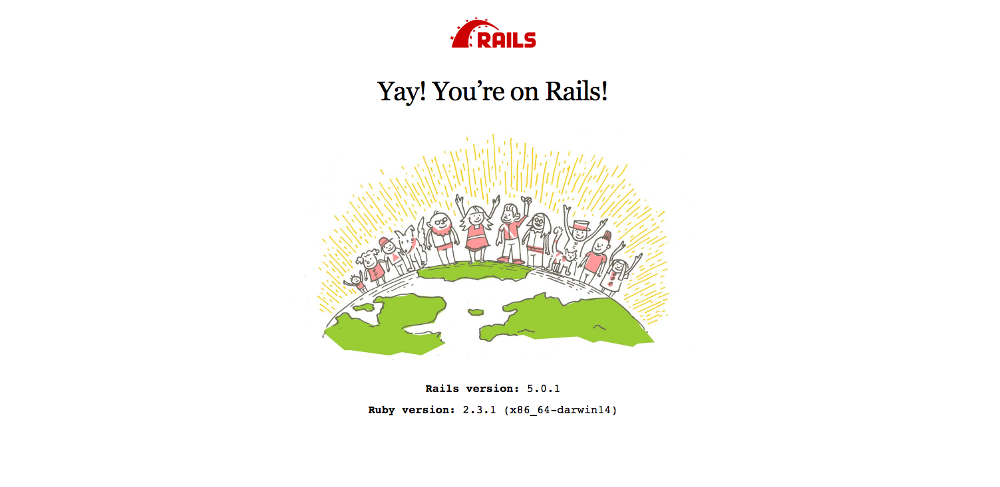

#Ruby on Rails Mac 安裝教學

1. 先安裝 Homebrew，Mac 的套件管理工具

	請打開你的 Terminal，輸入以下：

	```
	ruby -e "$(curl -fsSL https://raw.githubusercontent.com/Homebrew/install/master/install)"
	```

2. 安裝 rbenv，Ruby 語言的版本管理工具

	```
	brew install rbenv ruby-build
	```

3. 讓 rbenv 再每次開啟 Terminal 時都會運作

	```
	echo 'if which rbenv > /dev/null; then eval "$(rbenv init -)"; fi' >> ~/.bash_profile
	source ~/.bash_profile
	```

4. 安裝 Ruby 2.2.3，並設為預設的 Ruby 版本，Ruby安裝過程較長，請耐心等候

	```
	rbenv install 2.3.3
	rbenv global 2.3.3
	```

5. 安裝完後，輸入

	```
	ruby -v
	```

	應該會顯示 

	```
	ruby 2.3.3
	```

6. 設定你的 git 

	打開 git 的彩色輸出
	```
	git config --global color.ui true
	```

7. 設定 git 的 user 和 email

	```
	git config --global user.name "你的名字"
	git config --global user.email "你的 Email"
	```
8. 讓 git 記住你，不需每次上傳 code 都要重打

	```
	git config --global credential.helper store
	```

9. 安裝 bundler (管理應用程式 Gem 依存性(dependencies)管理工具，它會根據 Gemfile 的設定自動下載及安裝 Gem 套件)

	```
	gem install bundler
	```

10. 接下來，安裝 Rails gem

	```
	gem install rails -v 5.0.0.1
	```

11. 跑完之後，輸入以下指令確保 Rails 可被 rbenv 讀取到

	```
	rbenv rehash
	```

12. 最後，確認一下剛才安裝的 Rails 版本是否正確：

	```
	rails -v
	```

13. 應該會顯示：

	```
	Rails 5.0.1
	```

	恭喜！你已經安裝完開發環境了！！！

16. 建立你的第一個 Rails app

	```
	rails new my_app_name

	```
17. 進入 Rails 專案的根目錄

	```
	cd my_app_name
	```

18. 接下來啟動 rails server：

	```
	rails server
	```

17. 打開你的瀏覽器，輸入網址： 

	```
	localhost:3000
	```
	若成功應該出現以下畫面：
	

## 恭喜你完成第一個 Rails app！！！


1. 安裝 Visual Studio Code

	[VS Code 官網](https://code.visualstudio.com/Download)

2. 設定 Code 的快捷指令
	```
	echo 'alias code="open -a 'Visual Studio Code'"' >> ~/.bash_profile
	```